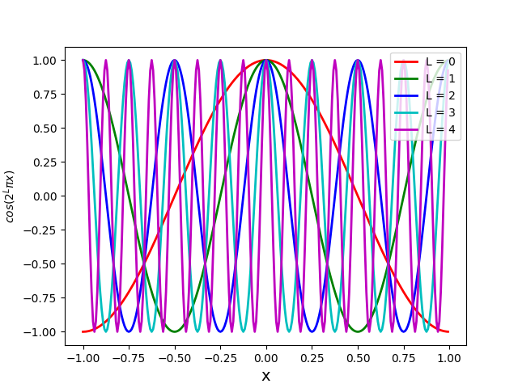

## nerf2D 

nerf2D is a 2D toy illustration of the [Neural Radiance Fields](http://www.matthewtancik.com/nerf). The code shows how adding the gamma encoding (also referred to as positional encoding and Eq. 4 in the NeRF paper) improves results significantly. 

The task is to reconstruct an image (pixel colour values) from its 2D coordinates. The dataset consists of tuples ((x, y), (r, g, b)) where the input is (x, y) and output is (r, g, b). We train a 2 layer MLP with relu activations to map (x, y) to (r, g, b). The input is normalised (as also mentioned in the paper) to range [-1, 1] and we also output in range [-1, 1]. The purpose of this 2D illustration is to show that lifting the input observation (x, y) to higher dimensions via these transformations (via gamma encoding) makes it easier for network to learn things. Training with with raw (x, y) results in blurry reconstructions while adding gamma encoding shows dramatic improvements in the results _i.e._ it is able to preserve the sharp edges in the image. 

=&space;[\sin(\pi&space;x),\cos(\pi&space;x),\sin(\pi&space;y),\cos(\pi&space;y),\sin(2\pi&space;x),\cos(2\pi&space;x),\sin(2\pi&space;y),\cos(2\pi&space;y),.....,\sin(2^{L-1}\pi&space;x),\cos(2^{L-1}\pi&space;x),\sin(2^{L-1}\pi&space;y),\cos(2^{L-1}\pi&space;y)])


The sin plots for various values of L are:


The corresponding cos plots are:




Below, we show results with and without positional encoding. We use 2 layer MLPs each with `128` features with `ReLU` activations. The left image is the dataset image, the middle is the reconstruction using positional encoding and the right is the reconstruction with just raw (x, y). The flickering in the images is due to renormalisation of (r, g, b) from [-1, 1] to [0, 255] at every epoch. Note that the network that uses (x, y) as input is hardly able to get any high frequency details in the results.

In the positional encoding we use `L=10` for most of the cases, but for higher frequency reconstructions this number could be increased. This largely varies from image to image so this should be treated as a hyper-parameter. This positional encoding bears a lot of resemeblance to the famous Random Fourier Features in the paper from [Rahimi & Recht](https://people.eecs.berkeley.edu/~brecht/papers/07.rah.rec.nips.pdf). In this particular case of positional encoding used in this repo, we have features computed at different scales and a phase shift of pi/2. In our experiments, we found both scale and phase shift to be very important. The repo also has code for experiments with sawtooth and RBF features with scale and phase shift.

## Glasses Image 

Image Credits: http://hof.povray.org/glasses.html


## Cool Cows Image

Image Credits: http://hof.povray.org/vaches.html


## House Image

Image Credits: http://hof.povray.org/dhouse39.html


## Requirements

```
tensorflow 2.0
opencv-python
python 3.6
```

## Contact 

Ankur Handa (handa (dot) ankur (at) gmail (dot) com)