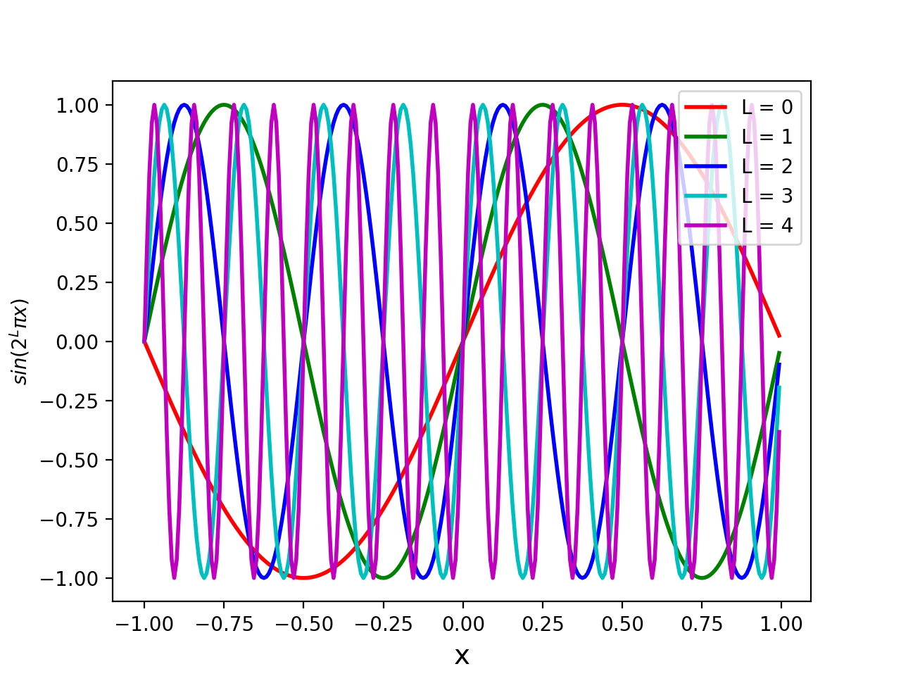
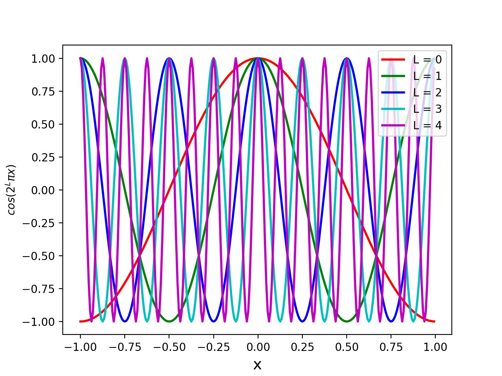

## nerf2D 

nerf2D is a 2D toy illustration of the [NeRF](http://www.matthewtancik.com/nerf). The code shows how adding the gamma encoding (Eq. 4) in the paper improves results significantly. 

The task is to reconstruct an image from its 2D coordinates. The dataset consists of tuple ((x, y), (r, g, b)) where the input is (x, y) and output is (r, g, b). We train a 2 layer MLP with relu activations. The input is normalised (as also mentioned in the paper) to range [-1, 1] and we also output in range [-1, 1]. However, simply training with with raw (x, y) results in blurry reconstructions while adding gamma encoding shows dramatic improvements in the results. The gamma encoding is able to preserve the sharp edges in the image.

The sin plots for various values of L look like the following 

The corresponding cos plots are

